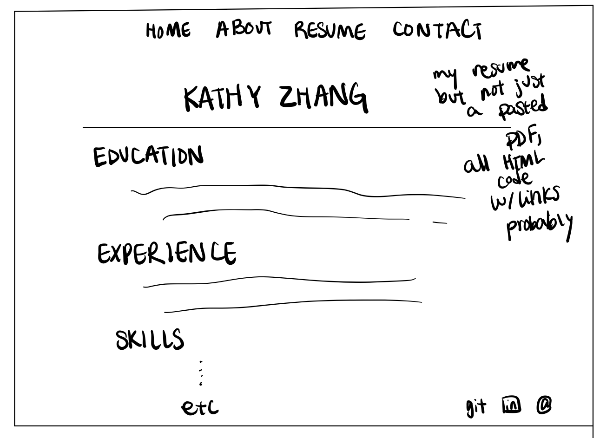

# Project 1: Design Journey

Your Name: Kathy Zhang

**All images must be visible in Markdown Preview. No credit will be provided for images in your repository that are not properly linked in Markdown. Assume all file paths are case sensitive!**

## Markdown (DELETE ME)

[**Delete this markdown instructions section before you submit your final assignment.**]

This is a Markdown file. All written documents that you will submit this semester will be Markdown files. Markdown is a commonly used format by developers and bloggers. It's something that you should know.

The following links are Markdown references:
* <https://guides.github.com/features/mastering-markdown/>
* <https://github.com/adam-p/markdown-here/wiki/Markdown-Cheatsheet>

When writing your Markdown file in VS Code. Open the command palette and search for **Markdown: Open Preview**. This will open up a panel in Code where you can preview your formatted Markdown file.

This is how your insert images into your Markdown documents:

[**Delete this markdown instructions section before you submit your final assignment.**]

# Project 1, Milestone 1 - Design & Plan

## Website Topic

[Tell us what your website is about. What are you promoting?]
My website is about myself and is promoting myself.

## Target Audiences

[Tell us about your two target audiences.]
My two target audiences are potential software engineering recruiters or future employers, as well as friends and people who generally want to know more about me.

## Design Process

[Document your design process. Show us your sketches. Show us your card sorting. Show us the evolution of your design from your first idea (sketch) to design you wish to implement (sketch). Show us the process you used to organize content and plan the navigation (card sorting).]

I'm thinking of having 4 pages for my site. Home, About, Resume, and Contact. Contact will be the sticky form page.
First, I'm thinking of a rather minimalist and simple design for the home page. It should have a picture of me in the center as the main part of the page and a big background image, probably of my garden or a nice picture I find off the internet.
The header is a nav bar that has all the re-directs to the other pages of the website.

For the first draft of the Home page, I decided to put the picture of me in the middle as said above, and also probably include some big title above the picture as indication that we're on the home page (even though the header also has an indication of that too). Below the picture, is a short introduction of the webpage, probably along the lines of Welcome to my interactive portfolio or something like that. I will also include a footer.

For the second and final draft of the Home page, I decided to change the title of the page to something more welcoming, like greeting the user to my page. This targets my second target audience: friends or people who want to know more about me. I also came up with what pages I would like to include in my webpage and put it in the header. For the footer, I decided to keep small icons of my contact information and social medias (though they are also on the contact page).

For the first draft of the About page, I put a title on the page called About Me in the center of the web page. Underneath on the left are some pictures of me and on the right are bullets with certain topic lines like who I am, what I do, what I'm interested in, where I'm from, etc.

For the second and final draft of the About page, I decided that a continuous scroll of pics of me and my various hobbies (and whatever else the text is talking about) would be more aesthetic on the left side of the webpage. There would be no gaps between the pictures and they would all be the same size. On the right, I decided against too many bullet points because it felt a little cluttered. I decided to go with a short section that says "Short Intro", or perhaps "Briefly" or something like that, and underneath it would have some bullet points about general info like who I am, age, gender, what I do, etc. Then, under a more detailed section labeled "Furthermore" or something like that, I will talk in paragraphs about hobbies and other information about myself. Maybe I will also have a section about projects and extracurriculars. I don't know if I will include an overall title on the top of the page saying "About Me". I feel like that would be too cluttered.

For the first draft of the Resume page, I considered just making a generic document viewer like the ones in Blackboard, or perhaps a redirection to a pdf of my resume.

Then, for the second draft, I thought that a simple redirection or download link to the pdf would be super boring. There's no point in making a webpage for it if all it is is a link that I can insert anywhere. After looking at inspiration, I noted that many people decided to rewrite their resume on the webpage so it looked prettier and fit with the theme of the webpage. I will also include links to make my resume like a interactive webpage resume on the resume page.

Then I decided that perhaps I include a download link or link to the PDF anyways at the end of the page or maybe at the top of the page so that future employers can just download the PDF and stow it away in their files, like they would if I applied to their company via job posting.

For the first draft of the Contact page, I just had static icons with links next to them.

For the final draft of the Contact page, I decided to make it a sticky form. Under the title, "Contact Me", I have a few icons of all my social media like linkedin and github for recruiters and instagram and facebook for friends and others. I also have an email address listed out. Beneath this, is the sticky form, with inputs Name, Topic, Return address (sender's email), and Message, and then the Send button. Once the message is sent, the confirmation page is just a plain page, maybe with a solid color background or with the same picture background as the Homoe page, with words like "Your message to Kathy has been sent!" and a link to return to the Contacts and/or Home page.

[Thoroughly document this process. The _process_ is the important part of this assignment, not the final result.]

## Final Design Plan

[Include sketches of your final design here. Don't forget to design the form and its confirmation page!]

[Include your site navigation here. Describe the content on each page. Tip: use bulleted lists.]
Home page:
-picture of me in the middle
-big title above picture
-brief welcoming description underneath picture
-big aesthetic picture as background
About page:
-continous line of pictures of me and certain things that pertain to me on left side
-on right column, first a short introduction with bullet points, then a longer section in paragraphs about more personal details
Resume page:
-my resume in HTML and with links, making it interactive
-a link to a downloadable PDF version of my resume
-don't know if I should put projects and extracurriculars on this page or my about page...
Contact page:
-form and confirmation page on here
-icons of all my social medias with links

## Target Audiences' Needs

[Tell us how your design meets the needs of both of your target audiences.]
My design meets the needs of recruiters and future employers because it looks clean and professional. The pages, specifically the "brief" first section of the About page and the Resume page as a whole will sell myself to recruiters by talking about my experiences. The resume page in particular gives a fun, clean, and interactive way to see my projects and extracurriculars and previous internships with links and (maybe) pictures.
To friends and those who want to know more about me, the About page talks a lot about me in general, regardless of skills that employers might want. I talk about my hobbies and me as a person. I also have all my contact information and social medias up, like instagram and facebook, for friends to find and connect with.
Both audiences can also send me a message: personal or professional, using the sticky form on the contact page.

## Templates

[Now that you've finalized your design, identify the templates you will use on your site.]
header/nav bar template
footer template

# Project 1, Milestone 2 - Draft Website

## Sticky Form

[What fields are required for your form?]
Name, email, topic, message

[Plan out your error messages for your target audiences here.]
If there is anything unfilled, a error message saying Please fill out the required areas will appear. Name, topic, message are invalid if there's nothing there. Email is invalid if there's no @ character in the input. The boxes will be outlined in red so the user knows which inputs are wrong.

## Validation Code Plan

[Write out your pseudocode plan for handling the validation of the form.]
Thanks for sending a message!
<?php
    if (isset($valid_form) && $valid_form) {
      $valid_form = true; ?>
      <h1>Thank you for your message!</h1>
    <?php

  } else {
    ?> ... //the rest of the form

# Final Submission: Complete & Polished Website

## Target Audiences

[Tell us how your final site meets the needs of the target audiences. Be specific here. Tell us how you tailored your design, content, etc. to make your website usable by both target audiences.]
The final site meets the needs of the target audiences. The home page is a simple aesthetic home page that welcomes everyone. The about page talks about what I want to do professionally and academically for recruitors as well as what I am like as a person and my hobbies for people who want to know me better. The resume page is mainly for future employers and recruitors. It gives a nice layout of my resume instead of just linking my resume boringly and has a lot of clickable links that turn teal when hovered over. The contact page is for both target audiences. Recruitors can send me messages about jobs or interest, and others cna sen me messages for whatever reason

## Reflection

[Take this time to reflect on what you learned during this assignment. How have you improved from 1300? What things did you have trouble with?]
I had a lot of trouble with HTML and CSS considering I didn't know anything about it before I took the class. But I picked up CSS style sheets and HTML kind of quickly. I learned creative ways to embed PHP code into HTML in order to make the website dynamic. I learned a lot about how browsers and servers send information back and forth to each other, and that safe things are usually done by server-side validation. I had trouble with divs and CSS code because I didn't understand how styling worked, especially with content wrapping and aligning elements so the website looked nice.
